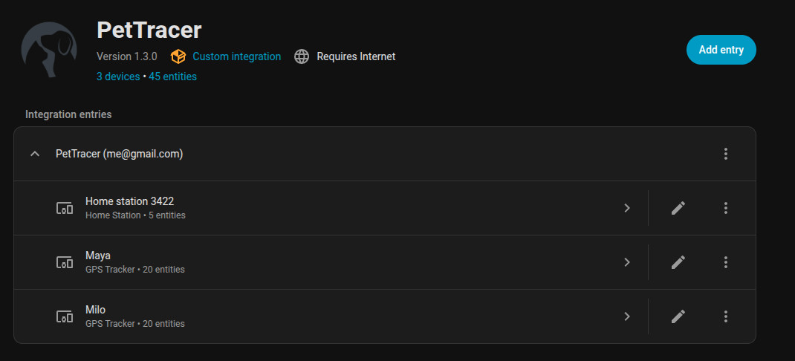
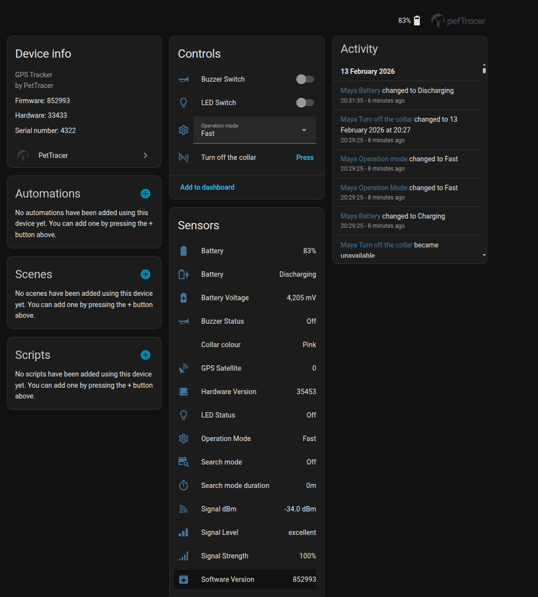
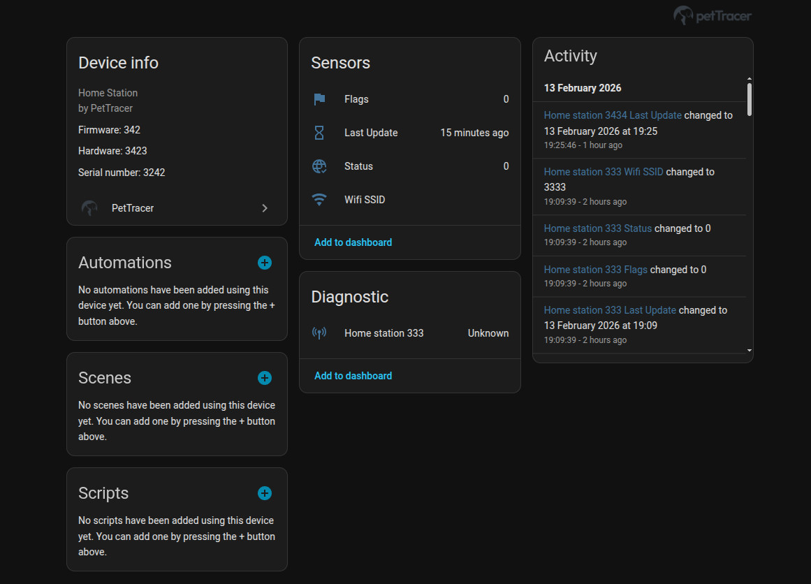

# PetTracer Integration for Home Assistant

[](https://github.com/hacs/integration)

A Home Assistant custom integration for [PetTracer](https://www.pettracer.com/) GPS pet trackers.

## Features

- 📍 **GPS Location Tracking** - See your pet's location on the Home Assistant map
- 📶 **Signal Strength Monitoring** - Track GPS signal strength in real-time
- 🔋 **Battery Level** - Monitor tracker battery status
- 🪫 **Battery voltage** - Monitor tracker battery voltage
- ⚡ **Battery status** - Monitor tracker battery status (charging,discharging, full, off)
- 📊 **Multiple Sensors** - Signal percentage, dBm, battery, and signal level
- 🔄 **Auto-refresh** - Via Websocket based on your mode
- 🐕 **Multi-device Support** - Works with multiple trackers on one account
- 🖥️ **Hardware information** - From software version to hardware version
- 🐕 **All the modes** - Showing all the modes of the collar, even the hidden ones!
- 🎼 **Buzzer and Led status** - Showing the current status of them
- ⌛ **Search mode information** - When search mode is enabled you get all the insight info
- 🎨 **Collar colour** - Expose your picked colour and can be used as SVG
- 🏠 **Home stations** - Show all your home stations and which wifi is connected
-  ⏻  **Turn off** - Be able to turn off the collar

## Entities

### Device Tracker
Comprehensive tracking for the PetTracer ecosystem. View all your cat collars on the map while 
accessing deep-layer attributes like raw voltage and last-seen timestamps. Includes full support 
for Home Stations, displaying connectivity status and hardware versions through dynamic, color-coded icons.




### Sensors





#### Collar

| Sensor               | Description                                                       | Unit    |
|----------------------|-------------------------------------------------------------------|---------|
| Signal Strength      | Signal strength as percentage                                     | %       |
| Signal dBm           | Signal strength in decibels                                       | dBm     |
| Signal Level         | Text (excellent/good/fair/poor/none)                              | -       |
| Battery Level        | Tracker battery level                                             | %       |
| Battery              | Tracker battery status (Discharging/Charging/Full/Offline/Unknown) | -       |
| Battery Voltage      | Tracker battery voltage                                           | mV      |
| Buzzer               | Buzzer status                                                     | On/Off  |
| LED                  | LED status                                                        | On/Off  |
| Collar colour        | Colour selected in the app provided in SVG and HEX                | -       |
| Hardware version     | Current Hardware version                                          | -       |
| Software version     | Current Software version                                          | -       |
| GPS Satellite        | Current GPS Satellite connected to the collar                     | -       |
| Operation Mode       | Current mode                                                      | -       |
| Search mode          | Current search mode                                               | -       |
| Search mode duration | Current search mode duration until reset to normal                | minutes |


| Switch        | Description   | Unit   |
|---------------|---------------|--------|
| Buzzer Switch | Switch Buzzer | On/Off |
| LED Switch    | Switch LED    | On/Off |


| Select         | Description                                 | Unit   |
|----------------|---------------------------------------------|--------|
| Operation mode | Change mode, see at the bottom for the list | -      |


| Button              | Description                                                                | Unit   |
|---------------------|----------------------------------------------------------------------------|--------|
| Turn off the collar | Turning off the collar, you can only active it when putting back to charge | -      |


#### Home station




| Sensor    | Description            | Unit |
|-----------|------------------------|------|
| Flags     | Current flags          | -    |
| Status    | Current status         | -    |
| Wifi SSID | Current wifi connected | -    |

## Installation

### HACS (Recommended)

1. Open HACS in Home Assistant
2. Click on "Integrations"
3. Click the three dots in the top right corner
4. Select "Custom repositories"
5. Add this repository URL: `https://github.com/max246/hacs-pettracer`
6. Select "Integration" as the category
7. Click "Add"
8. Search for "PetTracer" and install

### Manual Installation

1. Download the latest release
2. Copy the `custom_components/pettracer` folder to your Home Assistant `config/custom_components/` directory
3. Restart Home Assistant

## Configuration

1. Go to **Settings** → **Devices & Services**
2. Click **[+]() Add Integration**
3. Search for "PetTracer"
4. Enter your PetTracer account email and password
5. Your trackers will be automatically discovered

## Signal Level Thresholds

| Level | Percentage |
|-------|------------|
| Excellent | > 70% |
| Good | 50-70% |
| Fair | 30-50% |
| Poor | 5-30% |
| None | < 5% |

## Example Automations

### Alert when signal is weak

```yaml
automation:
  - alias: "Pet Tracker Signal Alert"
    trigger:
      - platform: numeric_state
        entity_id: sensor.tracker_signal_strength
        below: 30
        for: "00:05:00"
    action:
      - service: notify.mobile_app
        data:
          message: "⚠️ Pet tracker signal is weak ({{ states('sensor.tracker_signal_strength') }}%)"
```

### Log signal strength history

```yaml
sensor:
  - platform: statistics
    entity_id: sensor.tracker_signal_dbm
    name: "Tracker Signal 24h Average"
    state_characteristic: mean
    max_age:
      hours: 24
```

## Technical Details

This integration uses the PetTracer REST API to poll device data. The signal strength is calculated using the same formulas as the official PetTracer portal:

- **Raw RSSI to dBm**: `(255 & value) / 2 - 130`
- **dBm to Percent**: `100 × 1.35 × (1 - dBm / -130)`


### Modes

| Name | Mode ID | Poll Interval (sec) | Position Interval (sec) | Description |
| :--- | :---: | :---: | :---: | :--- |
| **NA** | 0 | 0 | 0 | Not Applicable |
| **FAST1** | 1 | 60 | 3600 | 1 min polling |
| **NORMAL1** | 2 | 180 | 10800 | 3 min polling |
| **SLOW1** | 3 | 900 | 86400 | 15 min polling |
| **SLOW2** | 4 | 180 | 14400 | 3 min polling |
| **TEST** | 5 | 10 | 30 | 10 sec polling |
| **SLOW4** | 6 | 60 | 14400 | 1 min polling |
| **SLOW3** | 7 | 180 | 7200 | 3 min polling |
| **FAST2** | 8 | 60 | 300 | 1 min polling |
| **FAST3** | 9 | 60 | 120 | 1 min polling |
| **BATLOW** | 10 | 3600 | 43200 | Battery Low Mode (1hr) |
| **SEARCH** | 11 | 21 | 21 | Search Mode |
| **OFF** | 12 | 0 | 0 | Device Off |
| **NORMAL2** | 14 | 60 | 1800 | 1 min polling |
| **PEIL1** | 16 | 15 | 3600 | 15 sec polling |
| **PEIL2** | 17 | 30 | 3600 | 30 sec polling |
| **PEIL3** | 18 | 10 | 3600 | 10 sec polling |
| **PEIL4** | 19 | 5 | 3600 | 5 sec polling |


## Troubleshooting

### "Invalid credentials" error
Make sure you're using the same email and password as the PetTracer mobile app or web portal.

### No devices found
Ensure your tracker is registered and visible in the PetTracer app.

### Data not updating
Check the Home Assistant logs for any API errors. The integration retries automatically on connection failures.

### Collar not working
You might have turned off the collar, you have to place the collar in the charging dock until it turns on

### Mode are not the same
There are hidden modes that are not listed in the app, see the modes list what are they.


## Support

- 🐛 [Report a bug](https://github.com/max246/hacs-pettracer/issues)
- 💬 [Discord](https://discord.gg/home-assistant)

## License

MIT License - See [LICENSE](LICENSE) for details.
